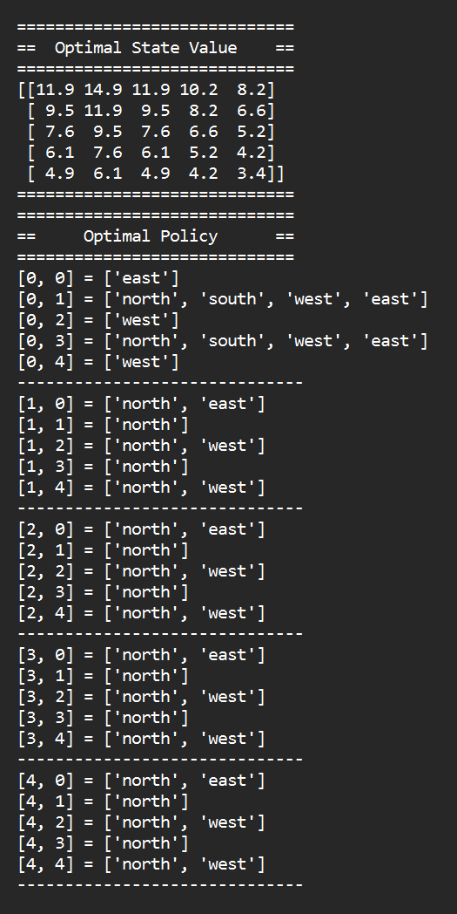
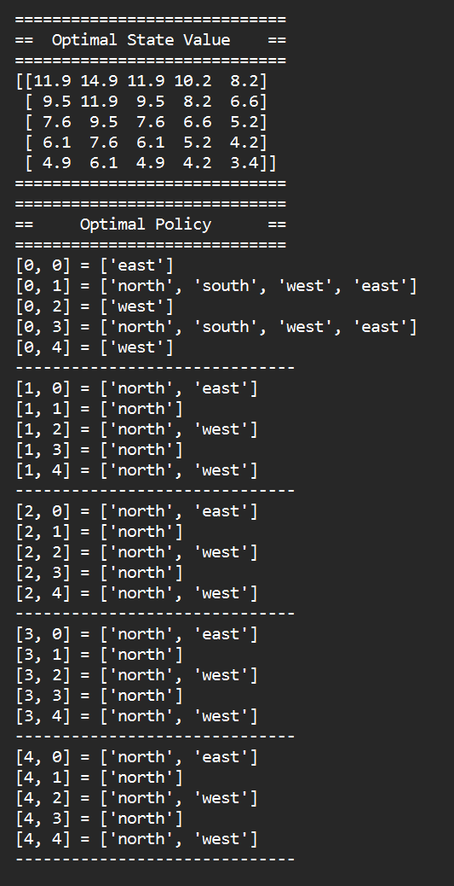
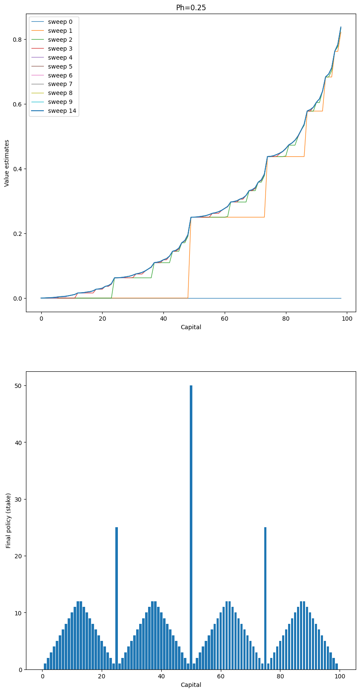
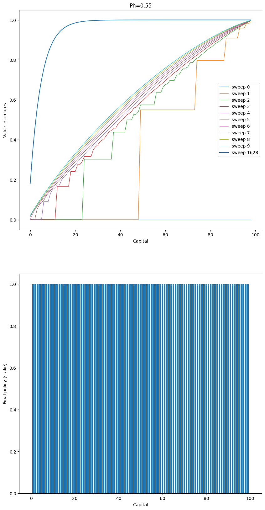

# Ex3
### Adnan Amir   CS 5180   Spring 2025
 

## Q1 Written
**(a) \(v_*\) in terms of \(q_*\)**
The state-value function \(v_*\) can be expressed as the maximum of the action-value function \(q_*\) over all actions:

\[
v_*(s) = \max_a q_*(s, a)
\]

**(b) \(q_*\) in terms of \(v_*\) and \(p\)**
The action-value function \(q_*\) can be expressed using the reward function \(r(s, a)\), the transition probability \(p(s' | s, a)\), and the value function \(v_*\):

\[
q_*(s, a) = r(s, a) + \gamma \sum_{s'} p(s' | s, a) v_*(s')
\]

**(c) \(\pi_*\) in terms of \(q_*\)**
The optimal policy \(\pi_*(s)\) selects the action that maximizes the action-value function \(q_*\):

\[
\pi_*(s) = \arg\max_a q_*(s, a)
\]

**(d) \(\pi_*\) in terms of \(v_*\) and \(p\)**
The optimal policy \(\pi_*(s)\) can also be defined indirectly through \(v_*\), \(p\), and \(r\):

\[
\pi_*(s) = \arg\max_a \left[ r(s, a) + \gamma \sum_{s'} p(s' | s, a) v_*(s') \right]
\]

---

## Q2 Written

**(a)**
Looking at the problem, It looks like choosing action b in state x and y will result in a never ending loop between those two states and the MDP will never terminate. Thus, action b should not be chosen at all. But, there is a -1 reward for state x and -2 for state y, so maybe it is okay to take action b in state y, so you can go to state x. In state x, I think the optimal action is action c because there is a chance of termination and the reward is maximized.

**(b)**

We have to start with an arbitrary policy. So, Initializing \(\pi_0\) as:
\[
    \pi_0(x)= c,\quad \pi_0(y) = c
\]
####  Policy Evaluation:

Under \(\pi_0\):
- In state x the action is c. The Bellman equation is:
  
  \[
  v_{\pi_0}(x) = r(x,c) + 0.8\,v_{\pi_0}(x) + 0.2\cdot 0,
  \]
  
  where the \(0.2\) probability leads to termination (value 0). Since \(r(x,c) = -1\), we have:
  
  \[
  v_{\pi_0}(x) = -1 + 0.8\,v_{\pi_0}(x).
  \]
  
  Solving:
  
  \[
  0.2\,v_{\pi_0}(x) = -1 \quad \Longrightarrow \quad v_{\pi_0}(x) = -\frac{1}{0.2} = -5.
  \]

- In state y the action is c. The Bellman equation is:
  
  \[
  v_{\pi_0}(y) = r(y,c) + 0.8\,v_{\pi_0}(y) + 0.2\cdot 0.
  \]
  
  With \(r(y,c) = -2\), we get:
  
  \[
  v_{\pi_0}(y) = -2 + 0.8\,v_{\pi_0}(y).
  \]
  
  Solving:
  
  \[
  0.2\,v_{\pi_0}(y) = -2 \quad \Longrightarrow \quad v_{\pi_0}(y) = -\frac{2}{0.2} = -10.
  \]

Now, we compute the Q-values for both actions in each state using the values from \(\pi_0\).

####  Policy Improvement for \(\pi_0\):

For State x:

- **Action c:**

  \[
  Q(x,c) = r(x,c) + 0.8\,v_{\pi_0}(x) = -1 + 0.8(-5) = -1 - 4 = -5.
  \]

- **Action b:**

  \[
  Q(x,b) = r(x,b) + 0.7\,v_{\pi_0}(y) + 0.3\,v_{\pi_0}(x).
  \]
  
  With \(r(x,b) = -1\), \(v_{\pi_0}(y) = -10\), and \(v_{\pi_0}(x) = -5\):
  
  \[
  Q(x,b) = -1 + 0.7(-10) + 0.3(-5) = -1 - 7 - 1.5 = -9.5.
  \]
  
Since \(-5 > -9.5\), the best action in **x** is **c**.

For State y:

- **Action c:**

  \[
  Q(y,c) = r(y,c) + 0.8\,v_{\pi_0}(y) = -2 + 0.8(-10) = -2 - 8 = -10.
  \]

- **Action b:**

  \[
  Q(y,b) = r(y,b) + 0.7\,v_{\pi_0}(x) + 0.3\,v_{\pi_0}(y).
  \]
  
  With \(r(y,b) = -2\), \(v_{\pi_0}(x) = -5\), and \(v_{\pi_0}(y) = -10\):
  
  \[
  Q(y,b) = -2 + 0.7(-5) + 0.3(-10) = -2 - 3.5 - 3 = -8.5.
  \]
  
Since \(-8.5 > -10\), the best action in **y** is **b**

Thus, improved polivy is
\[
\pi_1(x)= c,\quad \pi_1(y)= b.
\]

#### Policy evaluation for \(\pi_1\):

**State x:**

Since \(\pi_1(x) = c\), the equation remains:

\[
v_{\pi_1}(x) = -1 + 0.8\,v_{\pi_1}(x).
\]

Solving:

\[
0.2\,v_{\pi_1}(x) = -1 \quad \Longrightarrow \quad v_{\pi_1}(x) = -5.
\]

**State y:**

Now \(\pi_1(y) = b\), so the Bellman equation is:

\[
v_{\pi_1}(y) = r(y,b) + 0.7\,v_{\pi_1}(x) + 0.3\,v_{\pi_1}(y).
\]

Substitute \(r(y,b) = -2\) and \(v_{\pi_1}(x) = -5\):

\[
v_{\pi_1}(y) = -2 + 0.7(-5) + 0.3\,v_{\pi_1}(y) = -2 - 3.5 + 0.3\,v_{\pi_1}(y).
\]

Rearrange to solve for \(v_{\pi_1}(y)\):

\[
v_{\pi_1}(y) - 0.3\,v_{\pi_1}(y) = -5.5 \quad \Longrightarrow \quad 0.7\,v_{\pi_1}(y) = -5.5,
\]

\[
v_{\pi_1}(y) = -\frac{5.5}{0.7} = -\frac{55}{7} \approx -7.857.
\]

#### Polict improvement for \(\pi_1\):

- **State x:**
  - \(Q(x,c) = -1 + 0.8(-5) = -5\).
  - \(Q(x,b) = -1 + 0.7(-10) + 0.3(-5) = -9.5\).
  
  The best action in **x** remains **c**.

- **State y:**
  - \(Q(y,c) = -2 + 0.8(-7.857) \approx -2 - 6.2857 \approx -8.2857\).
  - \(Q(y,b) = -2 + 0.7(-5) + 0.3(-7.857) \approx -2 - 3.5 - 2.357 = -7.857\).
  
  The best action in **y** remains **b**.

There is no change in the action choices, the policy has converged. Therefore, the optimal policy \(\pi_*\) is

\[
\pi_*(x)= c,\quad \pi_*(y)= b.
\]

And the state values \(v_*\) are
\[
v^*(x)= -5, \quad v^*(y) = -7.857
\]

**(c)**

If we start with the following policy \(\pi_0\):
\[
\pi_0(x) = b, \quad \pi_0(y) = b
\]

We will only be jumping between states x and y infinitely.
If the rewards are undiscounted (\(\gamma = 1\)), then we will get a return of \(-\infty\). Thus according to the bellman equation in the policy evaluation step:

\[
v_\pi(s) = r(s,\pi(s)) + \gamma \sum_{s'} p(s' \mid s,\pi(s))\,v_\pi(s') \quad \text{(Equation 3.4)}
\]

 \(v_\pi(s') \to -\infty\) as time goes on and the equation does not have a finite value. Thus, making policy iteration impossible.

If, however, we add some discounting (\(\gamma = 0.9\)), then \(v_\pi(s)\) will have a finite value because the return will eventually become so small that \(v_\pi(s)\) converges to a finite value. Thus we can apply policy iteration on it.

Policy iteration will eventually converge to the same optimal policy we derived above. It might take more iterations but the convergence will remain the same.

---

## Q3 Code

Attaching Snippets here

**(a)**

**(b)**

---

## Q4 Written

**(a)**

There is indeed a bug in the pseudocode because it does not consider the case where the policy improvement step can replace an action with a different action that has the same q value. Because it seems to favor the new action over the current one. Thus, the policy may not converge because the improvement step keeps cycling between two optimal policies.

To fix it, we can just break ties in favor of the current policy, if the new policy is not definitely better, we will keep the current policy and the algorithm will converge.

The pseudocode change is as follows

    for each state s:  
      old_action = π(s)
      # Compute the Q-values for all actions at state s
      Q(s, a) = R(s, a) + γ * V(s')   for each action a
      best_action = argmax_a Q(s, a)
      
      # Only update the policy if the new best action is strictly better 
      than the current action.
      if Q(s, best_action) > Q(s, old_action):
          π(s) = best_action
          policy_stable = False
      else:
          # Retain the old action if it is just as good.
          π(s) remains unchanged

**(b)**

There is no such issue in the value iteration because the update formula makes it so that it converges to a unique fixed point regardless of how ties in the maximization are broken. Even if more than one action attains the maximum, the state-value function is uniquely determined. Hence, any ambiguity in the choice of action does not affect the convergence of the value function, and there is no risk of cycling.

---

## Q5

### (a) Written

I think that the main reason is the sparse reward function combined with the fact that the decision is driven by the need to maximize chance of winning. The gambler can only bet the smaller of the amount of money he has and the amount of money he needs to reach $100. ie: he can only choose \(\min_a(s,100-s)\)

So, at 50, he can bet a max of 50, this gets him to 100 and gets him the +1 reward. If he loses that, the game ends, for which there is no negative reward. Thus, the optimal action in that situation is to end it in the next flip. 

When he has 51, the max he can bet is 49, so he may win in one step, but if he loses, he will have \$2 and he still has to play the game, so the optimal action is betting very small, if he bets \$1, he can win and get closer to 100, if he loses, he will be at \$50 which can again put him in the position to win.

### (b) Code

The plots are provided below, it seems like the policy does become stable, as \(\theta \to 0\). However, for the \(ph \geq 0.5\) case, The agent only makes bets of 1, which seems wierd. This could also be due the fact we are rounding our q values.

