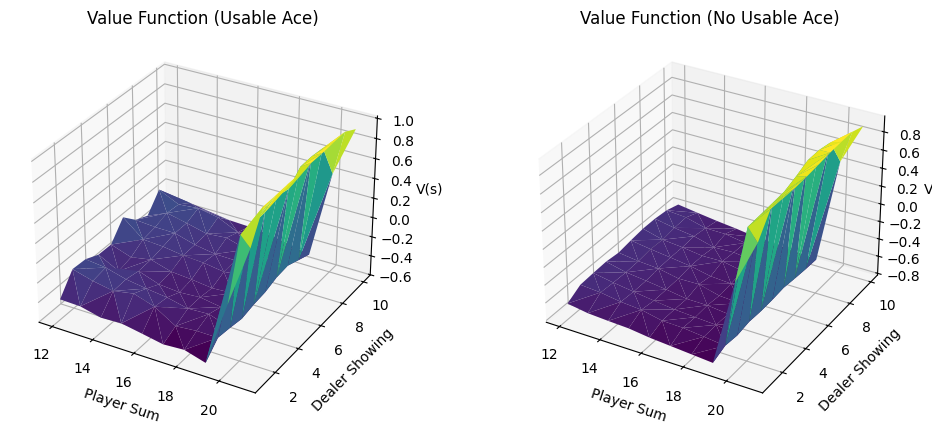
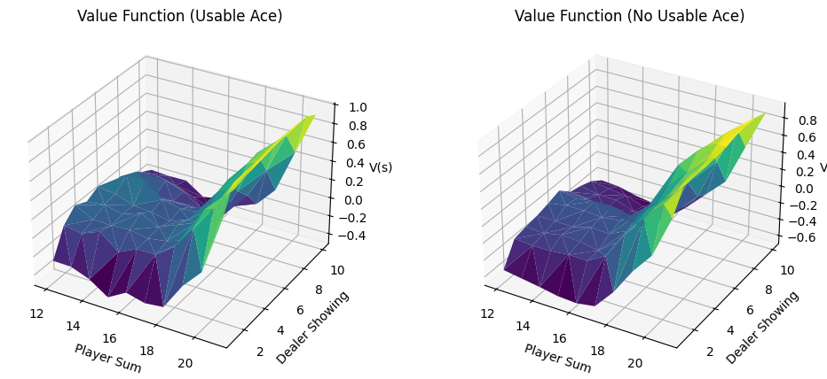
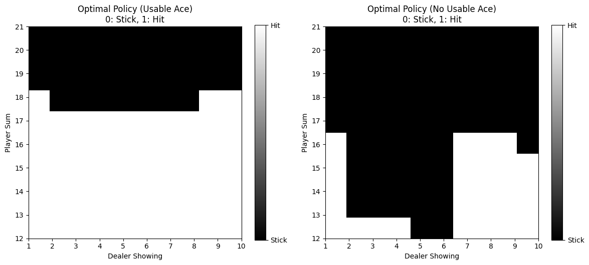
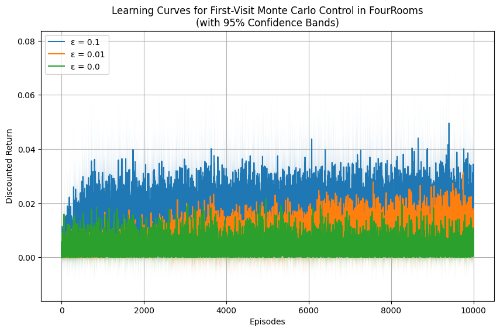
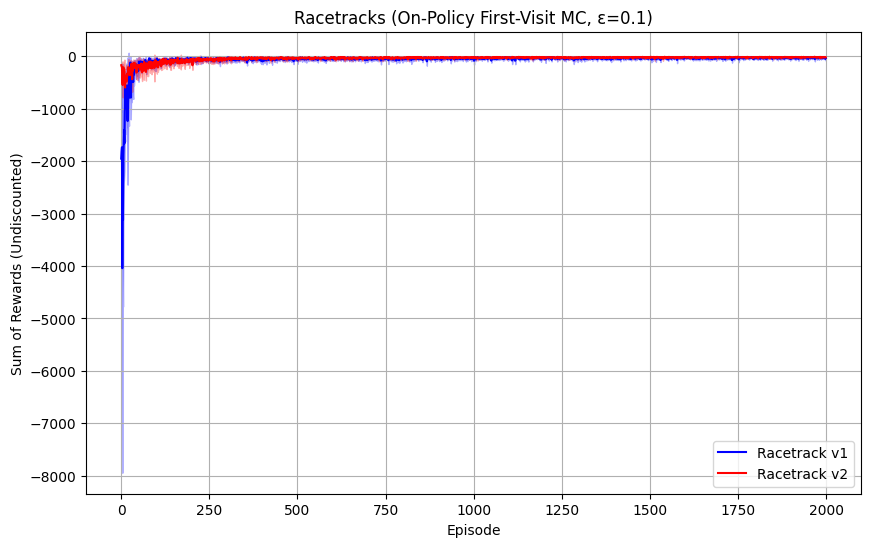
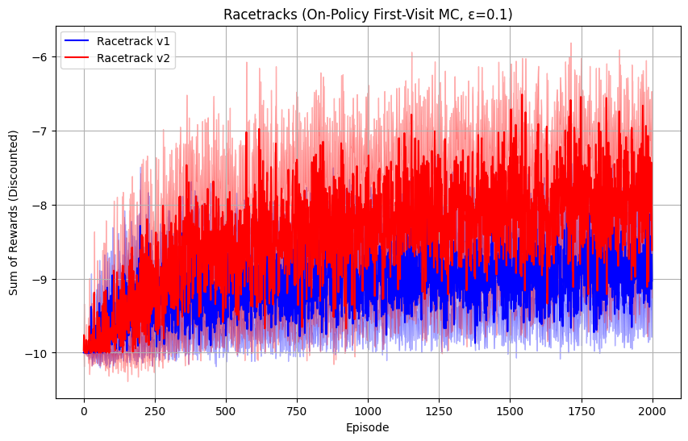
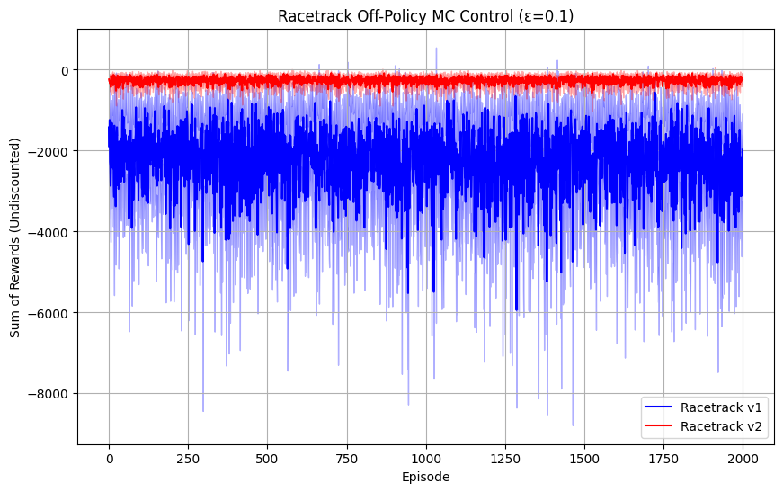
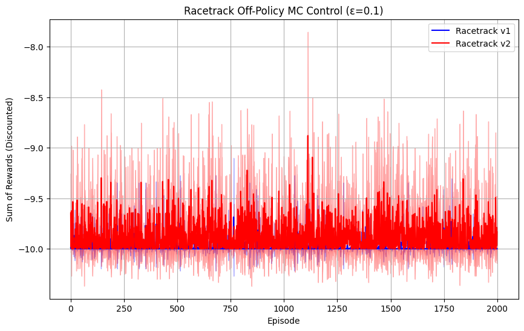

# EX4   Adnan Amir   Spring 2025
---
## Q1) 
### a)
It would not make a lot of difference because if we used first visit or every visit, simply because it is extremely improbable that we end up in the same state (our hand, dealers up card, usable ace) in blackjack multiple times in one episode (or game).

### b)
According to MDP
- States: $S0$ (Non Terminal) and $S1$ (Terminal)
- Action: $A$
- Transition Dynamics:
$$
p(S0 \hspace{4pt}|\hspace{4pt} S0,A) = p \\
p(S1 \hspace{4pt}| \hspace{4pt}S0,A) = 1-p
$$
- No Discountng: $\gamma=1$
- Observed episode: One episode is observed that lasts 10 steps (i.e. 10 transitions occur) and the total return $G=10$.

**First Visit**
For first-visit, we use only the return following the first occurrence of $S0$ in the episode. Since the episode started at $S0$ and then lasted 10 transitions, the return from that first visit is 10.

$V(S0)=10$

**Every Visit**
The return on the first visit is 10, the subsequent ones are 1 less.

So, the value is the average of all the returns.

$V(S0) = \frac{10+9+8+7+6+5+4+3+2+1}{10}=5.5$

---

## Q2
### a)

### b)

---
## Q3
### a)

### b)
The $\epsilon = 0$ plot converges to a suboptimal policy.

In Monte-Carlo Exploring Starts, we assume that each episode can begin from any state–action pair (with nonzero probability). This guarantees that all state–action pairs are sampled and updated over time.

Without exploring starts and without any exploration ($\epsilon=0$), the agent never visits large parts of the state–action space. So, it never learns accurate action values for those unvisited states and actions, and the policy converges with suboptimal behavior.

Exploring starts adds that much needed exploration aspect and allows the agent to converge to the optimal policy and follow it properly (Having $\epsilon > 0$ will still do random actions even after getting the optimal policy)

---
## Q4

Looking at the update step in the MC algorithm

$$
W= W \times \frac{\pi(A_t|S_t)}{b(A_t|S_t)}\\
Q(S_t,A_t) = Q(S_t,A_t) + \alpha W \bigl[G-Q(S_t,A_t)\bigr] \\
$$

Because the target policy $\pi$ is deterministic (greedy). If $b$ picks the same action $\pi$ would, $\pi(A_t|S_t) = 1$ and the importance sampling ratio becomes $\frac{1}{b(A_t|S_t)}$ and if $b$ picks something else, $\pi(A_t|S_t) = 0$ and there is no contribution towards update to the target policy from the return for that episode.

Thus $\frac{1}{b(A_t|S_t)}$ is correct

---
## Q5
### a)
This is the undiscounted return

This is the discounted return

### b)

This is the undiscounted return

This is the discounted return

### c)

- On‐Policy 
  - On‐Policy First Visit MC  tends to show a steadier convergence to near‐optimal behavior. The sum of rewards climbs out of large negative values relatively quickly and stabilizes.
  - On‐policy MC, by definition, does not rely on importance sampling. It updates estimates based on the same $\epsilon$-greedy policy it is evaluating and improving, so the returns—and the learning curves— appear less jumpy.
  - It can also be seen that it stabilizes much faster

- Off‐Policy 
  - Off policy MC with an $\epsilon$-soft behavior policy, shows larger variance and a more “choppy” learning curve. This is because the importance sampling corrections can introduce higher variance, especially early on.
  - Off‐policy learning curves have more extreme dips early on because if you get a mismatch between what the behavior policy does and what the target policy would do, it can lead to big fluctuations (or zero‐weight episodes).
  - Off‐policy should eventually match or approach a similar level of performance as on policy, but it can take more episodes to reach stable behavior

Also looking at the racetracks
- Racetrack v1 looks simpler but there is a sharp turn, so this track should be more difficult.
- Racetrack v2 has a complex geometry but looking at it, the turn is more gradual, so it should be easier for a car going full speed.
- This is clearly reflected in the plots, the blue line (Racetrack v1) is almost always in the negatives, meaning that the car is crashing a lot. In contrast, the Racetrack v2 only requires the car to fix its heading and it learns to do that very easily. If we were considering physics, it would be even harder to turn on track 1 because there's a strech of straight road to accelerate and pick up speed. But you can't do that on track 2.
