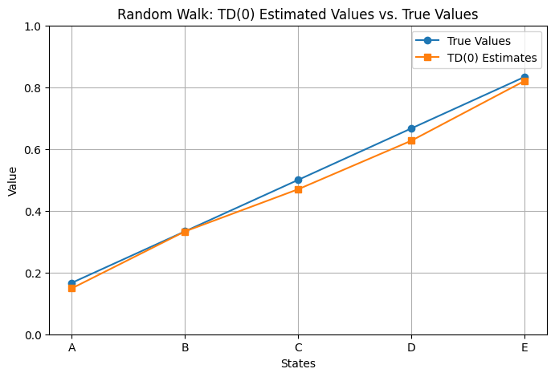
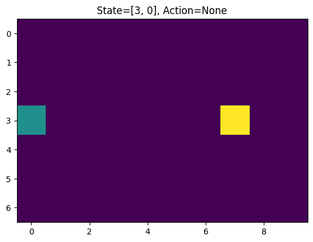
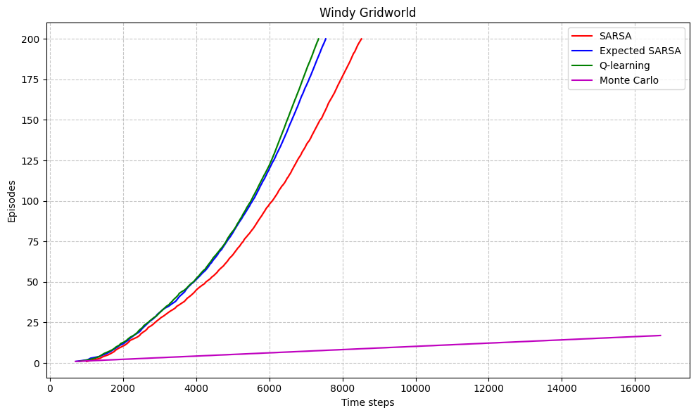
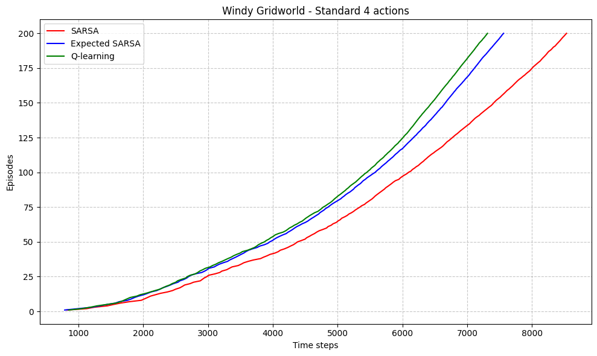
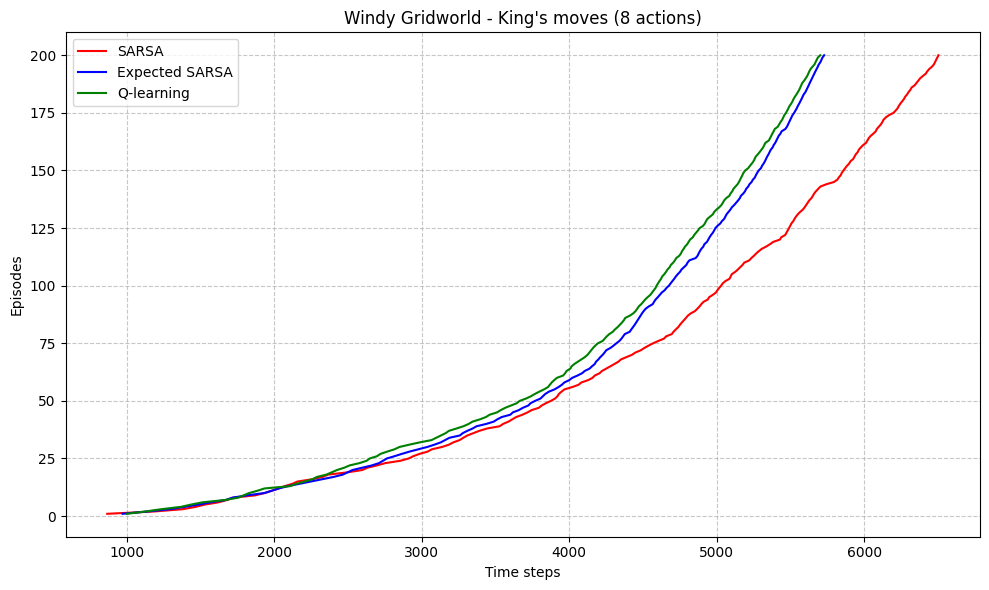
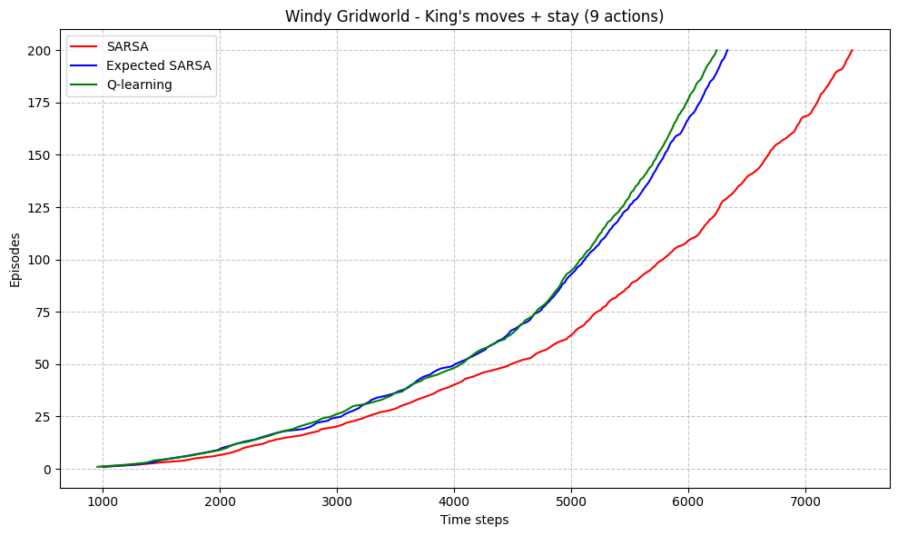
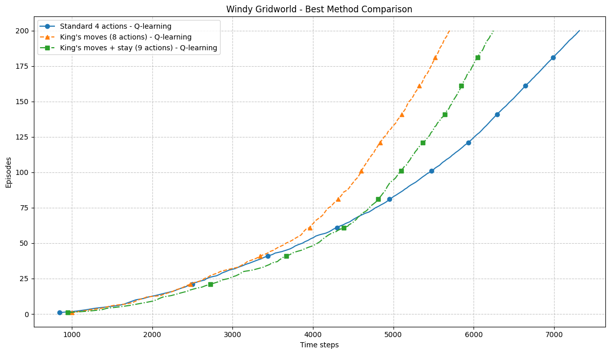
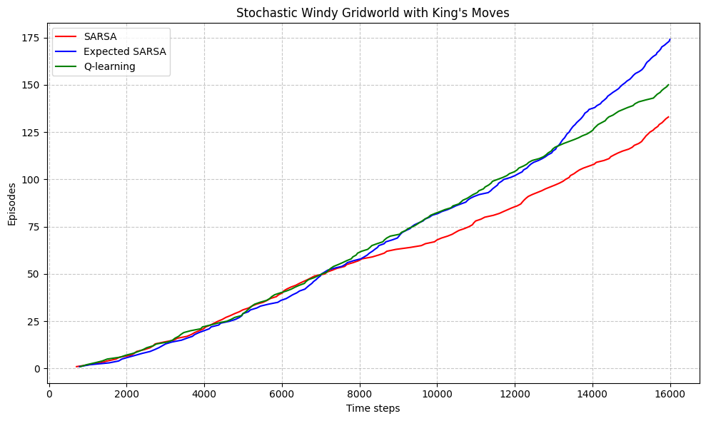
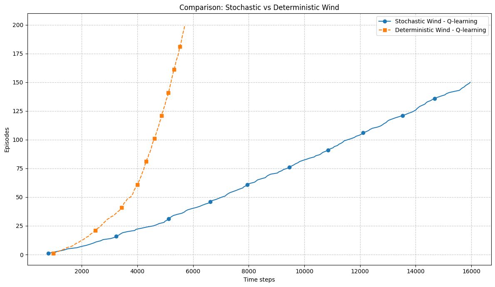
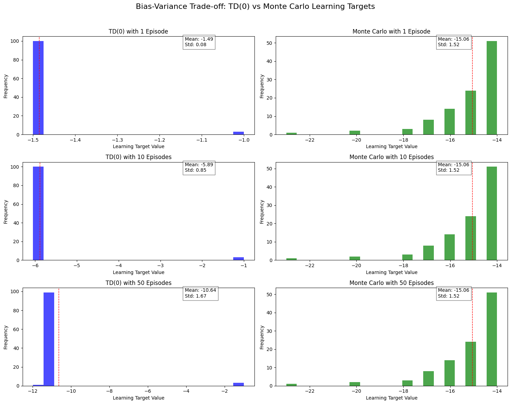

# EX5   Adnan Amir   Spring 2025

## Q1
### (a) 

Q-learning is considered an off-policy control method because it directly learns about the optimal policy (the target policy) while following a potentially different policy (the behavior policy).

In Q-learning's update rule:

$$Q(s,a) \leftarrow Q(s,a) + \alpha[r + \gamma\max_{a'}Q(s',a') - Q(s,a)]$$

The term $\max_{a'}Q(s',a')$ means Q-learning always considers the maximum possible future value regardless of what action might actually be selected next according to the current policy. This allows Q-learning to learn the optimal value function even while following an exploratory policy such as ε-greedy.

### (b) 

When action selection is greedy (always choosing the action with the highest Q-value), Q-learning and SARSA are not exactly the same algorithm, though they become more similar.

Regarding action selections: If both algorithms have identical Q-tables and both use greedy selection, they would indeed make identical action selections in each state.

Regarding weight updates: They will not make exactly the same weight updates due to fundamental differences in their update rules:

SARSA's update rule:

$$Q(s,a) \leftarrow Q(s,a) + \alpha[r + \gamma Q(s',a') - Q(s,a)]$$

Q-learning's update rule:

$$Q(s,a) \leftarrow Q(s,a) + \alpha[r + \gamma\max_{a'}Q(s',a') - Q(s,a)]$$

Even with greedy selection where $a' = \arg\max_{a'}Q(s',a')$, the formulations remain distinct. SARSA uses the actual next action's value for its update, while Q-learning uses the maximum possible value in the next state.

In practice, with perfectly greedy selection, this difference becomes minimal but still exists, especially early in training when Q-values are frequently updated and the greedy action might change from one step to the next.

## Q2

## Q3
### (a)
    class WindyGridWorld(object):
        def __init__(self, enable_king_move=False, enable_no_move=False):
            """
            Windy GridWorld:
                - Grid shape: 7 rows x 10 columns
                - Start state: (3, 0)
                - Goal state:  (3, 7)
                - Wind:        [0,0,0,1,1,1,2,2,1,0] (applied as upward movement)
                - Reward:      -1 each step, 0 at goal
            Args:
                enable_king_move (bool): If True, agent can move in 8 directions.
                enable_no_move   (bool): If True, agent can choose to "stay" in place.
            """
            # Define the grid (7 rows x 10 columns)
            self.grid = np.zeros((7, 10))

            # Define the state space as all valid (row, col) in the grid
            # (Though you might not strictly need this list)
            self.state_space = [
                [r, c] for r in range(self.grid.shape[0])
                        for c in range(self.grid.shape[1])
            ]

            # Define start and goal states
            self.start_state = [3, 0]
            self.goal_state = [3, 7]

            # Define wind strength per column (upward movement)
            self.wind = np.array([0, 0, 0, 1, 1, 1, 2, 2, 1, 0], dtype=int)

            # Define possible actions
            if enable_king_move:
                # 8 directions (King's moves)
                moves = {
                    "up":         np.array([-1,  0]),
                    "down":       np.array([ 1,  0]),
                    "left":       np.array([ 0, -1]),
                    "right":      np.array([ 0,  1]),
                    "up-left":    np.array([-1, -1]),
                    "up-right":   np.array([-1,  1]),
                    "down-left":  np.array([ 1, -1]),
                    "down-right": np.array([ 1,  1])
                }
                # Optionally add "stay in place"
                if enable_no_move:
                    moves["stay"] = np.array([0, 0])
                self.action_space = moves
            else:
                # Standard 4 directions
                self.action_space = {
                    "up":    np.array([-1, 0]),
                    "down":  np.array([ 1, 0]),
                    "left":  np.array([ 0,-1]),
                    "right": np.array([ 0, 1])
                }

            # Track the current state, time step, and last action
            self.state = None
            self.t = None
            self.act = None

        def reset(self):
            """
            Resets the agent to the start state and returns (state, terminated).
            """
            self.state = self.start_state.copy()
            self.t = 0
            self.act = None
            terminated = False
            return self.state, terminated

        def step(self, act_key):
            """
            Takes a step in the environment given an action key (e.g. 'up', 'down', etc.).
            
            Args:
                act_key (str): One of the keys in self.action_space.

            Returns:
                next_state (list): [row, col]
                reward (float):    -1 each step, 0 if goal is reached
                terminated (bool): True if next_state is the goal state
            """
            # Record the chosen action key (for rendering/debug)
            self.act = act_key

            # Get the shift from the action space
            shift = self.action_space[act_key]

            # 1) Move according to the chosen action
            next_r = self.state[0] + shift[0]
            next_c = self.state[1] + shift[1]

            # 2) Apply wind (upward shift) based on the *column* of the current state
            wind_strength = self.wind[self.state[1]]
            next_r -= wind_strength

            # 3) Clip to grid boundaries
            max_r, max_c = self.grid.shape
            next_r = max(0, min(next_r, max_r - 1))
            next_c = max(0, min(next_c, max_c - 1))

            # Update the state
            self.state = [next_r, next_c]

            # Check if we reached the goal
            terminated = (self.state == self.goal_state)

            # Typical reward scheme: -1 per step, 0 upon reaching goal
            reward = 0.0 if terminated else -1.0

            self.t += 1
            return self.state, reward, terminated

        def render(self):
            """
            Render the current state of the environment.
            - 0 = empty
            - 1 = agent
            - 2 = goal
            """
            # Make a copy of the base grid
            plot_arr = self.grid.copy()
            # Place agent
            plot_arr[self.state[0], self.state[1]] = 1.0
            # Place goal
            plot_arr[self.goal_state[0], self.goal_state[1]] = 2.0

            # Simple visualization
            plt.clf()
            fig, ax = plt.subplots(1, 1)
            ax.set_title(f"State={self.state}, Action={self.act}")
            ax.imshow(plot_arr, origin='upper')
            plt.show(block=False)
            plt.pause(1)   # Pause so we can see the plot
            plt.close(fig)

### (b)

The MC was not terminating for most of the episodes. This is normal because the Windy Gridworld has an infinite horizon.

After adding a timeout parameter to the methods, I was able to get more finite horizon episodes

### (c)

Q-learning consistently outperforms both SARSA and Expected SARSA in all configurations, having the lowest average steps (15.10) in episodes 90-100.

Moving from 4 actions to 8 actions (King's moves) significantly improves learning speed - the agent reaches 200 episodes in fewer time steps with 8 actions vs. 4 actions.

Adding the "stay" action actually decreases performance slightly. This makes sense because:
- The "stay" option introduces another action to explore without providing much benefit
- It potentially increases the exploration space unnecessarily

Adding more actions generally allows for more precise navigation around obstacles and more direct paths to goals. However, there's a tradeoff between flexibility and the increased complexity of the action space that must be learned. In this case, 8 actions appears to be the sweet spot.

### (d)

Average steps in episodes 90-100:
- SARSA: 102.00
- Expected SARSA: 86.73
- Q-learning: 78.03

## Q4

### (a)

### (b)

#### Variance Observation
**Monte Carlo :**
- Shows consistently higher variance (standard deviation ≈ 1.52) across all training episode counts
- Has a wider, more dispersed distribution of learning targets
- The distribution shape remains relatively stable regardless of training episodes

**TD(0) :**
- Shows significantly lower variance, especially with fewer training episodes (std = 0.08 with 1 episode)
- The distribution is much narrower and more concentrated
- Interestingly, variance increases as more training episodes are used (from 0.08 to 1.67)

#### Bias Observation

**Monte Carlo:**
- Maintains a consistent mean value (-15.06) across all training conditions
- This stability suggests Monte Carlo is unbiased - its estimate doesn't systematically shift with more data
- The Monte Carlo target represents the "true" expected return from the start state

**TD(0):**
- Shows clear bias that changes dramatically with more training
- With 1 episode: mean = -1.49 (far from Monte Carlo's -15.06)
- With 10 episodes: mean = -5.89 (moving closer to Monte Carlo)
- With 50 episodes: mean = -10.64 (much closer to Monte Carlo's estimate)

#### Bias-Variance Trade-off

1. **With limited data (1 episode):**
   - TD(0) produces extremely low-variance estimates (std = 0.08) but with significant bias
   - Monte Carlo produces high-variance but unbiased estimates

2. **As training increases (50 episodes):**
   - TD(0)'s bias decreases substantially (mean moves from -1.49 to -10.64)
   - TD(0)'s variance increases (std from 0.08 to 1.67) as it becomes less "stubborn" about its estimates
   - Monte Carlo's characteristics remain consistent

3. **Convergence behavior:**
   - TD(0) is clearly converging toward Monte Carlo's unbiased estimate as training increases
   - This demonstrates how TD methods eventually reduce bias with sufficient data

This empirical evidence strongly supports the fact that TD methods trade off bias for lower variance, while Monte Carlo methods are unbiased but have higher variance. It also shows how this trade-off evolves with more training: TD methods gradually reduce bias while slightly increasing variance, eventually approaching the unbiased Monte Carlo estimate.

Practically, it means that TD methods are better in early learning when stable estimates are needed, while Monte Carlo's unbiased nature becomes more valuable with sufficient data or when precise estimates are required.