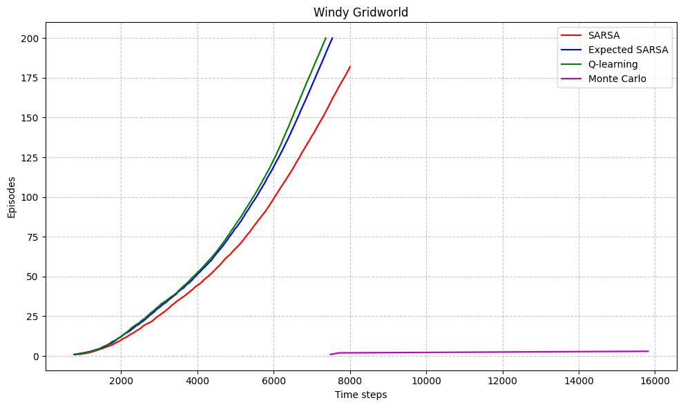

# EX5   Adnan Amir   Spring 2025

## Q1
### (a) 

Q-learning is considered an off-policy control method because it directly learns about the optimal policy (the target policy) while following a potentially different policy (the behavior policy).

In Q-learning's update rule:

$$Q(s,a) \leftarrow Q(s,a) + \alpha[r + \gamma\max_{a'}Q(s',a') - Q(s,a)]$$

The term $\max_{a'}Q(s',a')$ means Q-learning always considers the maximum possible future value regardless of what action might actually be selected next according to the current policy. This allows Q-learning to learn the optimal value function even while following an exploratory policy such as ε-greedy.

### (b) 

When action selection is greedy (always choosing the action with the highest Q-value), Q-learning and SARSA are not exactly the same algorithm, though they become more similar.

Regarding action selections: If both algorithms have identical Q-tables and both use greedy selection, they would indeed make identical action selections in each state.

Regarding weight updates: They will not make exactly the same weight updates due to fundamental differences in their update rules:

SARSA's update rule:

$$Q(s,a) \leftarrow Q(s,a) + \alpha[r + \gamma Q(s',a') - Q(s,a)]$$

Q-learning's update rule:

$$Q(s,a) \leftarrow Q(s,a) + \alpha[r + \gamma\max_{a'}Q(s',a') - Q(s,a)]$$

Even with greedy selection where $a' = \arg\max_{a'}Q(s',a')$, the formulations remain distinct. SARSA uses the actual next action's value for its update, while Q-learning uses the maximum possible value in the next state.

In practice, with perfectly greedy selection, this difference becomes minimal but still exists, especially early in training when Q-values are frequently updated and the greedy action might change from one step to the next.

The MC was not terminating much

Looking at these histograms, I can observe several key patterns that illustrate the bias-variance trade-off between TD(0) and Monte Carlo methods:

### Variance Comparison

**Monte Carlo (right column):**
- Shows consistently higher variance (standard deviation ≈ 1.52) across all training episode counts
- Has a wider, more dispersed distribution of learning targets
- The distribution shape remains relatively stable regardless of training episodes

**TD(0) (left column):**
- Shows significantly lower variance, especially with fewer training episodes (std = 0.08 with 1 episode)
- The distribution is much narrower and more concentrated
- Interestingly, variance increases as more training episodes are used (from 0.08 to 1.67)

### Bias Observation

**Monte Carlo:**
- Maintains a consistent mean value (-15.06) across all training conditions
- This stability suggests Monte Carlo is unbiased - its estimate doesn't systematically shift with more data
- The Monte Carlo target represents the "true" expected return from the start state

**TD(0):**
- Shows clear bias that changes dramatically with more training
- With 1 episode: mean = -1.49 (far from Monte Carlo's -15.06)
- With 10 episodes: mean = -5.89 (moving closer to Monte Carlo)
- With 50 episodes: mean = -10.64 (much closer to Monte Carlo's estimate)

### Bias-Variance Trade-off

1. **With limited data (1 episode):**
   - TD(0) produces extremely low-variance estimates (std = 0.08) but with significant bias
   - Monte Carlo produces high-variance but unbiased estimates

2. **As training increases (50 episodes):**
   - TD(0)'s bias decreases substantially (mean moves from -1.49 to -10.64)
   - TD(0)'s variance increases (std from 0.08 to 1.67) as it becomes less "stubborn" about its estimates
   - Monte Carlo's characteristics remain consistent

3. **Convergence behavior:**
   - TD(0) is clearly converging toward Monte Carlo's unbiased estimate as training increases
   - This demonstrates how TD methods eventually reduce bias with sufficient data

This empirical evidence strongly supports the theoretical claim that TD methods trade off bias for lower variance, while Monte Carlo methods are unbiased but have higher variance. It also shows how this trade-off evolves with more training: TD methods gradually reduce bias while slightly increasing variance, eventually approaching the unbiased Monte Carlo estimate.

In practical terms, this suggests TD methods may be preferable in early learning when stable estimates are needed, while Monte Carlo's unbiased nature becomes more valuable with sufficient data or when precise estimates are critical.