## Adnan

# Q1
Training Loss
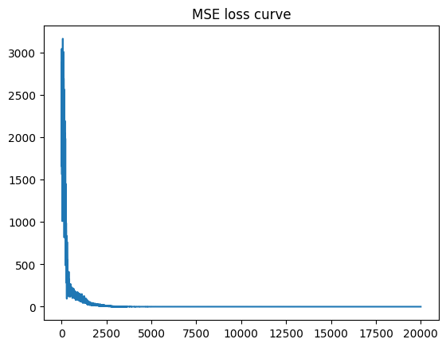

Train dataset
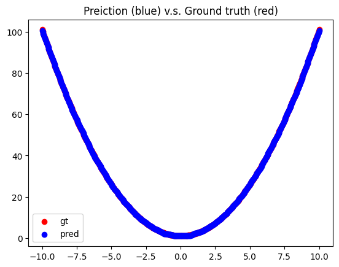

Dataset 2 (X>0)
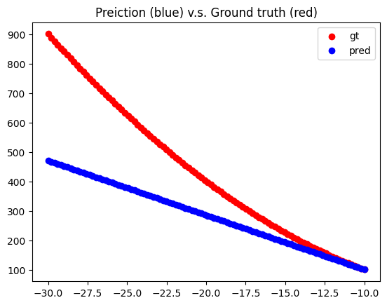

Dataset 3 (X<0)
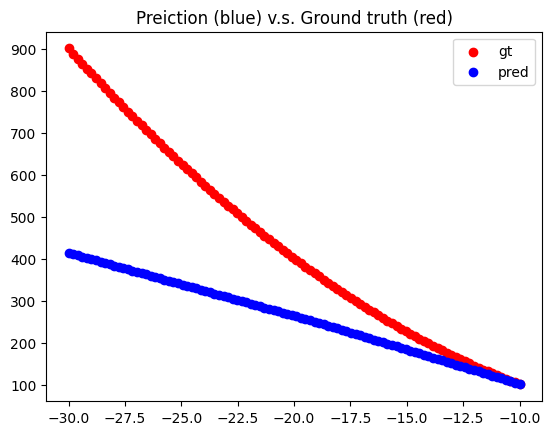

# Q2 DQN 4rooms
Discounted Returns
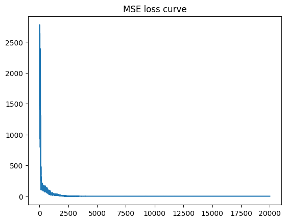

Loss wrt Training steps
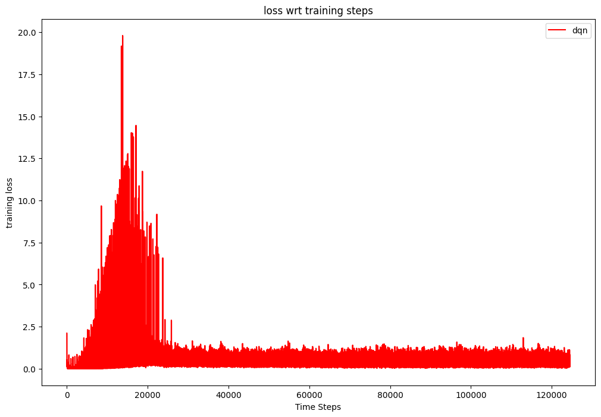

# Q3 DQN Cartpole/Lunarlander

Cartpole lengths
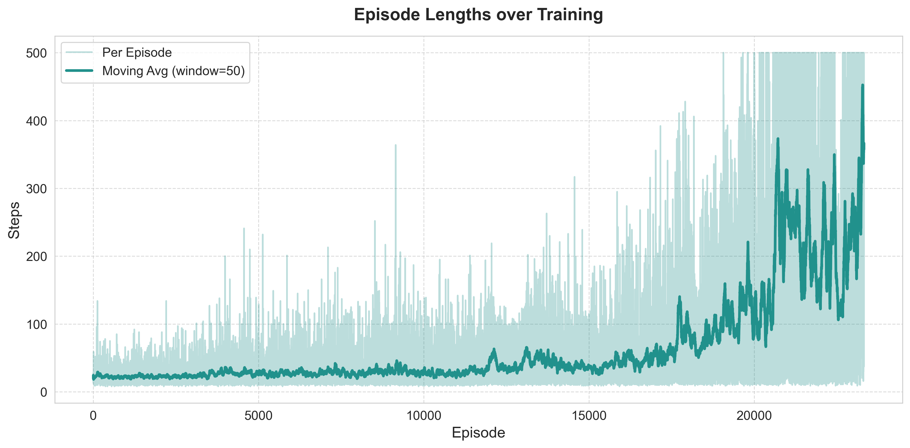

Cartpole Losses
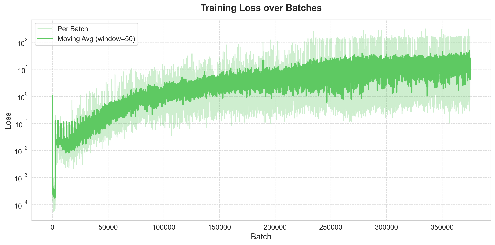

Cartpole Returns
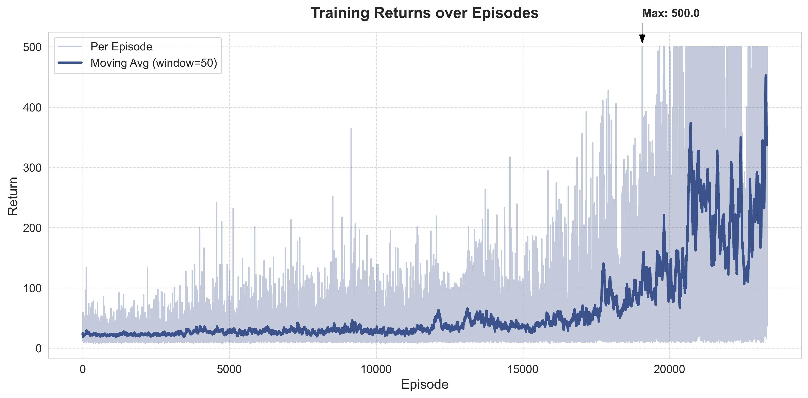

ll lengths

ll losses
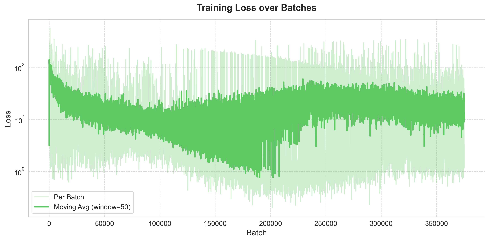

ll_returns
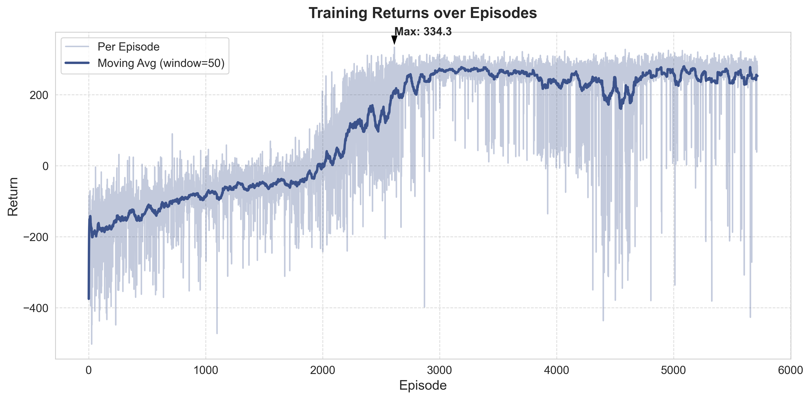