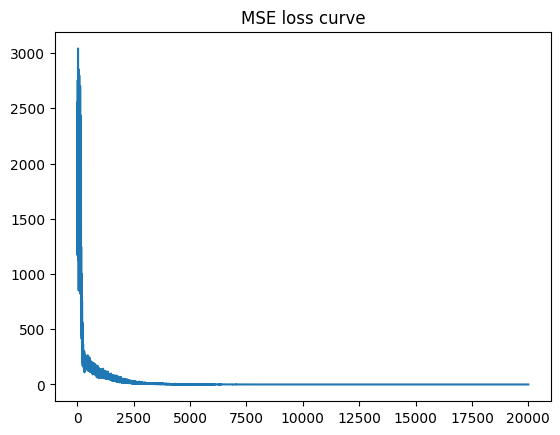
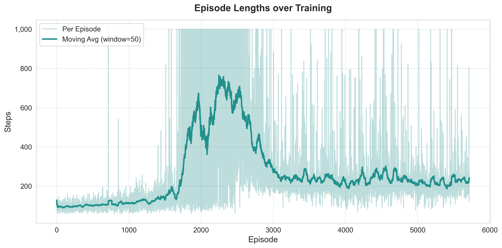

## Adnan

# Q1
Training Loss

Train dataset

Dataset 2 (X>0)

Dataset 3 (X<0)

# Q2 DQN 4rooms
Discounted Returns

Loss wrt Training steps

# Q3 DQN Cartpole/Lunarlander

Cartpole lengths

Cartpole Losses

Cartpole Returns

ll lengths

ll losses

ll_returns
