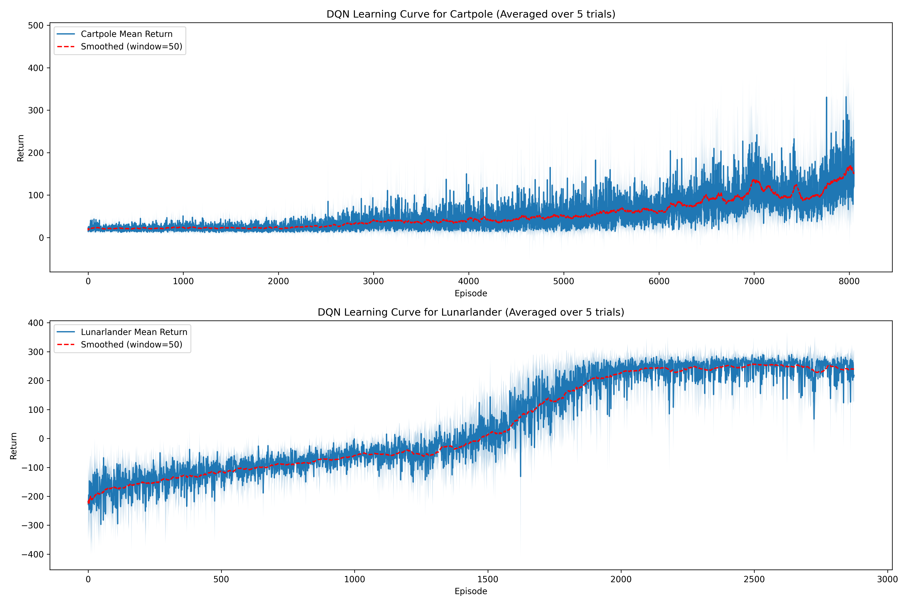

## Adnan

# Q1
- Training Loss
  - 8 hidden layers
  
  - 16 hidden layers
  
  - 64 hidden layers
  
  - 128 hidden layers
  

- Train dataset
  - 8 hidden layers
  
  - 16 hidden layers
  
  - 64 hidden layers
  
  - 128 hidden layers
  

- Dataset 2 (X>0)
  - 8 hidden layers
  
  - 16 hidden layers
  
  - 64 hidden layers
  
  - 128 hidden layers
  

- Dataset 3 (X<0)
  - 8 hidden layers
  
  - 16 hidden layers
  
  - 64 hidden layers
  
  - 128 hidden layers
  

## Written Part

The model seems pretty accurate within the training range but it does not generalize outside the range.

As we increase hidden layers, the genralization gets better, curves become smoother, but at 128 layers, it becomes worse because of overfitting.

It shows that neural networks are highly contingent on the data. They work well withing their training data, but can't even approximate the underlying structure behind a simple non linear function.

# Q2 DQN 4rooms
Discounted Returns

Loss wrt Training steps

MC control plot from ex4

## Written Part

1. **Performance Level**: 
   - The DQN implementation achieves much higher discounted returns, eventually reaching around -20, compared to the Monte Carlo method which maxes out at around 0.04.
   - This substantial difference suggests DQN is much more effective for the FourRooms environment.

2. **Learning Stability**:
   - DQN shows a more stable learning progression with clear convergence, starting from very low values (around -100) and steadily improving until plateauing.
   - The Monte Carlo methods show much more variability throughout training, with significant oscillations that don't clearly diminish over time.

3. **Variance**:
   - DQN's confidence bands narrow over time, suggesting increasing consistency across trials.
   - The Monte Carlo confidence bands remain wide throughout, indicating higher variance in performance.

4. **Sample Efficiency**:
   - DQN reaches near-optimal performance around 4000-6000 time steps.
   - Monte Carlo methods don't show clear convergence even after 10,000 episodes.

Thus, DQN is better than tabular methods like Monte Carlo for complex environments - it offers better performance, more stable learning, and typically requires fewer interactions with the environment to converge to a good policy, despite being more computationally intensive per step.

# Q3 DQN Cartpole/Lunarlander

Learning curves

Cartpole lengths

Cartpole Losses

Cartpole Returns

ll lengths

ll losses

ll_returns

## Written Part
1. **CartPole** 

   1. **Early Training (0%)**
At the beginning of training, the agent doesn't know which direction to go to stop the pole from falling, causing episodes to end immediately. The value function at this stage is likely uniform across all states, showing no meaningful differentiation between good and bad states - essentially a flat plane with random noise.

   1. **25% Training**
The agent begins moving in the right direction to counteract pole movement, but lacks speed regulation, eventually reaching the edge of the environment. The value function now shows some structure with higher values for states where the pole is more vertical, but cart position and velocity factors are still poorly represented - resembling a simple hill centered around the vertical pole position.

   1. **50% Training**
The agent learns to vary its speed rather than maintaining constant movement, alternating between acceleration and deceleration to keep the pole upright. However, it lacks precision in these adjustments and eventually loses control. The value function now incorporates both pole angle and angular velocity, showing more complex gradient patterns that guide corrective actions, but overestimating aggressive corrections.

   1. **75% Training**
The agent figures out how to use bursts of acceleration to control the pole but can't achieve stable equilibrium. The value function now accounts for multiple state variables with more accurate gradients, assigning higher values to states that lead to temporary stability, but still lacking representation of long-term equilibrium states.

   1. **100% Training**
The agent develops a sophisticated strategy - quickly moving left to induce controlled pole movement, then making a calculated shift right and properly decelerating to balance the pole. It makes minor adjustments to maintain stability despite epsilon-greedy exploration. The value function now accurately weights all state variables (pole angle, angular velocity, cart position, velocity), creating clear value gradients that guide toward long-term stability.

1. **LunarLander** 

   1. **Early Training (0%)**
The agent has no control over descent and crashes directly into the ground. The value function shows no meaningful patterns, with all states having similar, low values - essentially a flat plane.

   1. **25% Training**
The agent activates its bottom thruster to prevent crashing but hovers indefinitely without landing. The value function now assigns higher values to states with controlled vertical velocity, creating a safety barrier above the ground. This appears as a gradient that increases as altitude decreases, encouraging thrust activation.

   1. **50% Training**
The agent figures out basic landing but doesn't position between the flags, beginning to use side thrusters for horizontal control. The value function now incorporates horizontal position, showing higher values for controlled descent states and beginning to develop preference for landing zone alignment.

   1. **75% Training**
The agent successfully lands between the flags but inefficiently hovers before touchdown. The value function balances multiple objectives with highest values for accurate landings, forming a more complex surface with peaks around landing zone states, but still overvaluing cautious approaches.

   1. **100% Training**
The agent executes efficient direct descents, landing in one swift motion. The value function now properly weights all relevant factors (altitude, velocities, position, fuel efficiency), creating optimal guidance toward direct landing trajectories - appearing as a smooth channel leading from initial states to precise landing positions.

# Q4 Atari

#### Learning curve

The training of our DQN agent showed clear learning progression over approximately 4,000 episodes. As shown in the learning curve, the agent initially performed poorly with consistent scores around -21 (the worst possible score in Pong), but began showing significant improvement around episode 800. By episode 1,000, the agent had achieved positive average returns, and eventually stabilized with a smoothed average return of approximately 12-13 points.

#### Training Time and Computational Requirements

Training the complete model required approximately:
- 14 hours on a laptop with RTX 4070
- 4 hours on a desktop with RTX 4090

There is a significant impact of hardware acceleration on deep RL tasks.

#### Critical Hyperparameter Adjustments

1. **Terminal State Handling**: Implemented special terminal state handling in the target Q-value calculation, setting targets to -1 for terminal states, without this, the agent was learning to terminate the game, not win it.

2. **Initial Random Exploration**: Added a dedicated 50,000 frame period of pure random actions at the beginning of training to properly populate the replay buffer with diverse experiences, in addition to prepopulating it with 10,000 experiences.

3. **Target Network Update Frequency**: Reduced the target network update frequency from 10,000 to 5,000 frames to provide more stable learning signals.

4. **Replay Buffer Size**: Increased the replay buffer size to 500,000 transitions to retain more diverse experiences.

5. **Gradient Clipping**: Applied tighter gradient clipping (between -1 and 1) to prevent large parameter updates.

6. **Epsilon Decay Period**: Extended the epsilon decay from 1M to 2M frames thinking it would improve exploration, this likely slowed down learning. The rapid improvement phase in our learning curve suggests that for a relatively simple environment like Pong with clear reward signals, a faster decay schedule would have allowed the agent to exploit its knowledge earlier and potentially reach peak performance sooner.

The Q-value statistics demonstrate the agent's improving value estimation ability, with max Q-values peaking around 7.0 before stabilizing around 3.0. 

The return distribution shows a bimodal pattern with peaks around -20 (early training) and +15-20 (successful play), with relatively few episodes in the middle range, suggesting that the agent either completely succeeds or fails at the Pong task.

The return vs. episode length plot shows an interesting pattern where higher returns correlate with shorter episode lengths, indicating that winning games more quickly is the optimal strategy once the agent has learned the basics of the game.

Looking at the progress,

There's a significant jump in performance between 0% and 25% of training, showing the agent made substantial progress in the first quarter of training. (2.5M frames)

The performance between 50% and 75% of training is nearly identical (around 12.5 average return), because of the plateau midway through training.

There's minimal improvement between 25% and 75% checkpoints compared to the initial learning phase. because most of the learning occurs relatively early in the training process.

All in all, I think there was significant room for improvement, and I would have done it if the time constraints were not so tight for the training