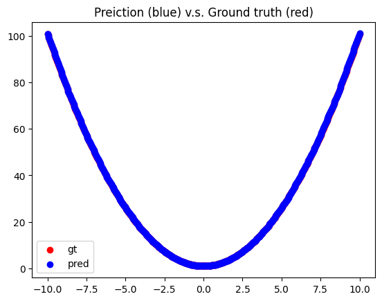
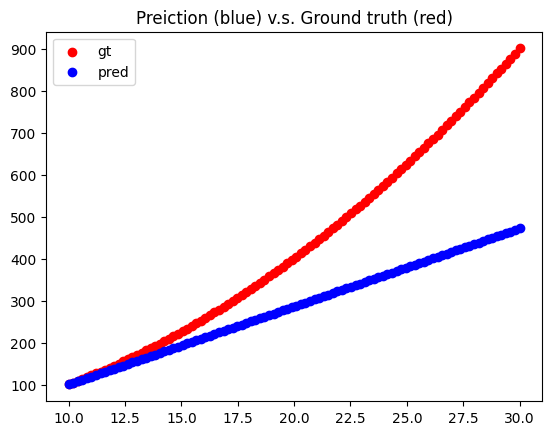

## Adnan

# Q1
Training Loss
- 8 hidden layers

- 16 hidden layers

- 64 hidden layers

- 128 hidden layers

Train dataset
- 8 hidden layers

- 16 hidden layers

- 64 hidden layers

- 128 hidden layers

Dataset 2 (X>0)
- 8 hidden layers

- 16 hidden layers

- 64 hidden layers

- 128 hidden layers

Dataset 3 (X<0)
- 8 hidden layers

- 16 hidden layers

- 64 hidden layers

- 128 hidden layers

# Q2 DQN 4rooms
Discounted Returns

Loss wrt Training steps

# Q3 DQN Cartpole/Lunarlander

Cartpole lengths

Cartpole Losses

Cartpole Returns

ll lengths

ll losses

ll_returns
