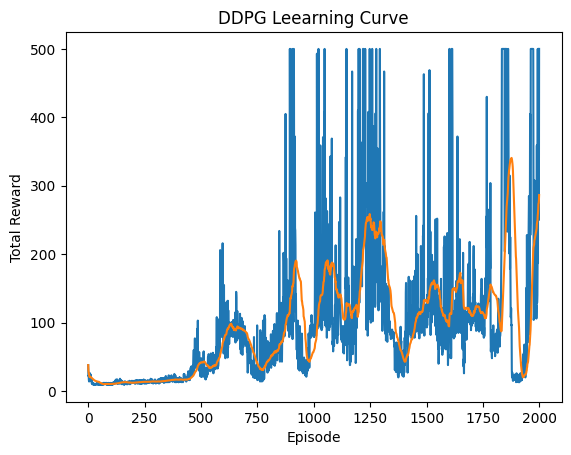
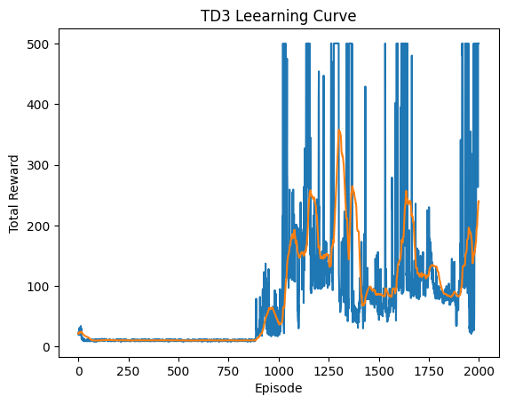
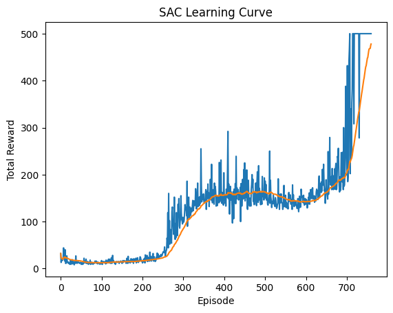
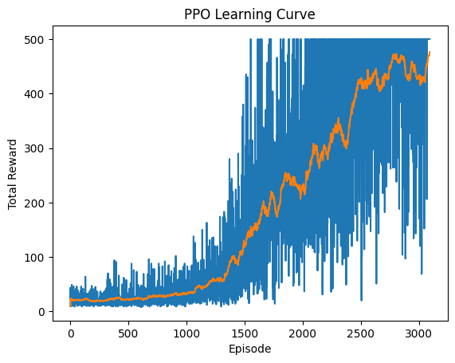

# CS 5180 - Ex 7 </br> Adnan Amir </br> Spring 2025 

## Q1

### Generalize the box on page 199, the policy gradient theorem (13.5), the proof of the policy gradient theorem (page 325), and the steps leading to the REINFORCE update equation (13.8), so that (13.8) ends up with a factor of $\gamma^t$ and thus aligns with the general algorithm given in the pseudocode

The standard REINFORCE algorithm is:

```
Initialize policy parameter θ arbitrarily
For each episode {s₀, a₀, r₁, s₁, a₁, r₂, ..., sₜ₋₁, aₜ₋₁, rₜ}:
    For each time step t = 0, 1, ..., T-1:
        Calculate G_t (the return from time step t)
        θ ← θ + α·G_t·∇ln(π(a_t|s_t,θ))
```


The generalized version with discount factor $\gamma^t$:

```
Initialize policy parameter θ arbitrarily
For each episode {s₀, a₀, r₁, s₁, a₁, r₂, ..., sₜ₋₁, aₜ₋₁, rₜ}:
    For each time step t = 0, 1, ..., T-1:
        Calculate G_t (the return from time step t)
        θ ← θ + α·γ^t·G_t·∇ln(π(a_t|s_t,θ))
```

The standard policy gradient theorem states:

$$\nabla J(\theta) = \mathbb{E}[G_t \nabla \ln \pi(a_t|s_t,\theta)]$$

The generalized policy gradient theorem with discount factor:

$$\nabla J(\theta) = \mathbb{E}[\gamma^t G_t \nabla \ln \pi(a_t|s_t,\theta)]$$

For a discounted reward objective function:

$$J(\theta) = \mathbb{E}\left[\sum_{t=0}^{T} \gamma^t r_{t+1}\right]$$

Expanding this expectation over states and actions:

$$J(\theta) = \sum_s d(s) \sum_a \pi(a|s,\theta) r(s,a)$$

Taking the gradient:

$$\nabla J(\theta) = \nabla\left[\sum_s d(s) \sum_a \pi(a|s,\theta) r(s,a)\right]$$

$$= \sum_s d(s) \sum_a \nabla\pi(a|s,\theta) r(s,a)$$

Using the identity $\nabla\pi(a|s,\theta) = \pi(a|s,\theta) \nabla\ln\pi(a|s,\theta)$:

$$= \sum_s d(s) \sum_a \pi(a|s,\theta) \nabla\ln\pi(a|s,\theta) r(s,a)$$

For the episodic case with $\gamma^t$ discounting:

$$\nabla J(\theta) = \mathbb{E}\left[\sum_{t=0}^{T} \gamma^t r_{t+1} \nabla\ln\pi(a_t|s_t,\theta)\right]$$

$$= \mathbb{E}[\gamma^t G_t \nabla\ln\pi(a_t|s_t,\theta)]$$

Where $G_t$ is the discounted return from time step $t$.

From the generalized policy gradient theorem:
   $$\nabla J(\theta) = \mathbb{E}[\gamma^t G_t \nabla\ln\pi(a_t|s_t,\theta)]$$

Using stochastic gradient ascent to maximize $J(\theta)$:
   $$\theta \leftarrow \theta + \alpha \nabla J(\theta)$$

Substituting our generalized policy gradient:
   $$\theta \leftarrow \theta + \alpha \mathbb{E}[\gamma^t G_t \nabla\ln\pi(a_t|s_t,\theta)]$$

For a single sample update:
   $$\theta \leftarrow \theta + \alpha \gamma^t G_t \nabla\ln\pi(a_t|s_t,\theta)$$

## Q2

### (a) Prove that adding a baseline to REINFORCE is still unbiased and the variance is lower.

Starting with:

$$\nabla_\theta J(\theta) = \mathbb{E}_{\tau\sim\pi_\theta}\left[\sum_{t=0}^{T}(R(\tau) - b(s_t))\nabla_\theta \log \pi_\theta(a_t|s_t)\right]$$

We can split this into two terms:

$$\nabla_\theta J(\theta) = \mathbb{E}_{\tau\sim\pi_\theta}\left[\sum_{t=0}^{T}R(\tau)\nabla_\theta \log \pi_\theta(a_t|s_t)\right] - \mathbb{E}_{\tau\sim\pi_\theta}\left[\sum_{t=0}^{T}b(s_t)\nabla_\theta \log \pi_\theta(a_t|s_t)\right]$$

The first term is the standard REINFORCE gradient. For the second term:

$$\mathbb{E}_{\tau\sim\pi_\theta}\left[\sum_{t=0}^{T}b(s_t)\nabla_\theta \log \pi_\theta(a_t|s_t)\right] = \sum_{t=0}^{T}\mathbb{E}_{s_t\sim\pi_\theta}\left[b(s_t)\mathbb{E}_{a_t\sim\pi_\theta(\cdot|s_t)}\left[\nabla_\theta \log \pi_\theta(a_t|s_t)\right]\right]$$

Since $\mathbb{E}_{a_t\sim\pi_\theta(\cdot|s_t)}\left[\nabla_\theta \log \pi_\theta(a_t|s_t)\right] = 0$ (a property of the score function), we have:

$$\mathbb{E}_{\tau\sim\pi_\theta}\left[\sum_{t=0}^{T}b(s_t)\nabla_\theta \log \pi_\theta(a_t|s_t)\right] = 0$$

Therefore:

$$\nabla_\theta J(\theta) = \mathbb{E}_{\tau\sim\pi_\theta}\left[\sum_{t=0}^{T}R(\tau)\nabla_\theta \log \pi_\theta(a_t|s_t)\right]$$

Which is exactly the original REINFORCE gradient. This proves that adding the baseline does not change the expected gradient, so the estimator remains unbiased.

For variance, we can show that adding an appropriate baseline reduces the variance of the gradient estimate.

The variance of the gradient estimate is:

$$\text{Var}\left[\sum_{t=0}^{T}(R(\tau) - b(s_t))\nabla_\theta \log \pi_\theta(a_t|s_t)\right]$$

This is minimized when $b(s_t) = \mathbb{E}_{\tau\sim\pi_\theta}[R(\tau)|s_t]$, which is the expected return given state $s_t$.

With this optimal baseline, the variance is lower than without the baseline because we're subtracting the expected value of the return for each state, leaving only the "surprise" component that contains the useful learning signal. This reduces the variance without changing the expected gradient.

### (b) What values could replace the $R(\tau)$ in REINFORCE?


1. **Future rewards from time $t$**: $G_t = \sum_{k=t}^{T} r_{k+1}$
   - Only considers rewards from time $t$ onward

2. **State-action value function**: $Q^\pi(s_t, a_t)$
   - Replaces the sampled return with its expected value

3. **Advantage function**: $A^\pi(s_t, a_t) = Q^\pi(s_t, a_t) - V^\pi(s_t)$
   - Uses the advantage of taking action $a_t$ in state $s_t$

4. **TD error**: $\delta_t = r_{t+1} + \gamma V^\pi(s_{t+1}) - V^\pi(s_t)$
   - Single-step temporal difference error

5. **$\lambda$-return**: $G_t^\lambda = (1-\lambda)\sum_{n=1}^{\infty}\lambda^{n-1}G_t^{(n)}$
   - A mixture of n-step returns with weight $\lambda$

All these alternatives provide unbiased estimates of the policy gradient, but with potentially different variance characteristics, considering that the key requirement is that any replacement for $R(\tau)$ must have the same expected value as the true return under the current policy.

## Q3

### (a) Explain why the standard policy gradient cannot be directly estimated when using trajectories sampled from $\beta$

The standard policy gradient is given by:

$$J(\theta) = \mathbb{E}_{\tau\sim\pi_\theta}[R(\tau)]$$

This cannot be directly estimated using trajectories sampled from a behavior policy $\beta$ because:

1. The expectation is explicitly over trajectories generated by the target policy $\pi_\theta$, but we only have samples from $\beta$.

2. The probability distribution over trajectories differs between $\pi_\theta$ and $\beta$, leading to different state-action visitation frequencies.

3. The gradient estimation requires samples from $\pi_\theta$ to compute:
   $$\nabla_\theta J(\theta) = \mathbb{E}_{\tau\sim\pi_\theta}\left[\sum_{t=0}^{T} R(\tau)\nabla_\theta \log \pi_\theta(a_t|s_t)\right]$$

4. If we naively use trajectories from $\beta$, the resulting gradient estimate would be biased because the state-action distribution doesn't match the one induced by $\pi_\theta$.

5. The derived gradient wouldn't represent the true direction of steepest ascent for the objective function $J(\theta)$ under the target policy.

### (b) Apply importance sampling to express the policy gradient objective in terms of expectations over trajectories from the behavior policy $\beta$ to derive off-policy PG

To derive the off-policy policy gradient, we need to apply importance sampling to correct for the distribution mismatch:

Starting with the standard policy gradient objective:
   $$J(\theta) = \mathbb{E}_{\tau\sim\pi_\theta}[R(\tau)]$$

Expressing this as an expectation under the behavior policy $\beta$ using importance sampling:
   $$J(\theta) = \mathbb{E}_{\tau\sim\beta}\left[\frac{P(\tau|\pi_\theta)}{P(\tau|\beta)}R(\tau)\right]$$

The probability of a trajectory $\tau$ under policy $\pi$ is:
   $$P(\tau|\pi) = P(s_0)\prod_{t=0}^{T}\pi(a_t|s_t)P(s_{t+1}|s_t,a_t)$$

The importance weight for a trajectory becomes:
   $$\frac{P(\tau|\pi_\theta)}{P(\tau|\beta)} = \frac{P(s_0)\prod_{t=0}^{T}\pi_\theta(a_t|s_t)P(s_{t+1}|s_t,a_t)}{P(s_0)\prod_{t=0}^{T}\beta(a_t|s_t)P(s_{t+1}|s_t,a_t)} = \prod_{t=0}^{T}\frac{\pi_\theta(a_t|s_t)}{\beta(a_t|s_t)}$$

Therefore:
   $$J(\theta) = \mathbb{E}_{\tau\sim\beta}\left[\prod_{t=0}^{T}\frac{\pi_\theta(a_t|s_t)}{\beta(a_t|s_t)}R(\tau)\right]$$

Taking the gradient:
   $$\nabla_\theta J(\theta) = \nabla_\theta\mathbb{E}_{\tau\sim\beta}\left[\prod_{t=0}^{T}\frac{\pi_\theta(a_t|s_t)}{\beta(a_t|s_t)}R(\tau)\right]$$

Using the log-derivative trick on the importance weights:
   $$\nabla_\theta\prod_{t=0}^{T}\frac{\pi_\theta(a_t|s_t)}{\beta(a_t|s_t)} = \prod_{t=0}^{T}\frac{\pi_\theta(a_t|s_t)}{\beta(a_t|s_t)}\sum_{t=0}^{T}\nabla_\theta\log\pi_\theta(a_t|s_t)$$

This gives us the off-policy policy gradient:
   $$\nabla_\theta J(\theta) = \mathbb{E}_{\tau\sim\beta}\left[\prod_{t=0}^{T}\frac{\pi_\theta(a_t|s_t)}{\beta(a_t|s_t)}R(\tau)\sum_{t=0}^{T}S\nabla_\theta\log\pi_\theta(a_t|s_t)\right]$$

This formula allows us to estimate the policy gradient using trajectories sampled from the behavior policy $\beta$, with appropriate importance sampling weights to correct for the distribution mismatch.

## Q4

 
 


### Observations

- **TD3**: Learns slowly at first (up to around episode 900), then suddenly gets better. It can reach top scores of 500 sometimes, but its performance goes up and down a lot.

- **DDPG**: Starts learning earlier than TD3 (around episode 500), but also shows unstable performance with big ups and downs in the average reward.

- **SAC**: Learns the smoothest. It starts improving around episode 300, stays steady for a bit, then keeps getting better and hits top performance by episode 750.

- **PPO**: Improves slowly but steadily. It takes more episodes (around 2500–3000) to reach top performance, but becomes more stable over time.

These patterns match how each algorithm is built:

- **Off-policy vs. On-policy**: SAC, DDPG, and TD3 can reuse old experiences, so they learn faster. PPO needs fresh data every time it updates, which makes training take longer.

- **Exploration**: DDPG and TD3 explore by adding noise, which makes learning bumpy. SAC uses a smarter way (entropy regularization) to explore, leading to smoother progress.

- **Update Stability**: TD3 improves on DDPG by using two critics and safer updates. PPO uses a method that avoids big, risky changes, helping it improve slowly but safely.

- **Sample Efficiency**: SAC learns the task in fewer episodes because it balances exploring and learning better than the others.

These differences show why choosing the right algorithm depends on what is required the most — whether it's fast learning, stable progress, or smart exploration.